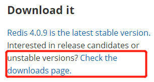
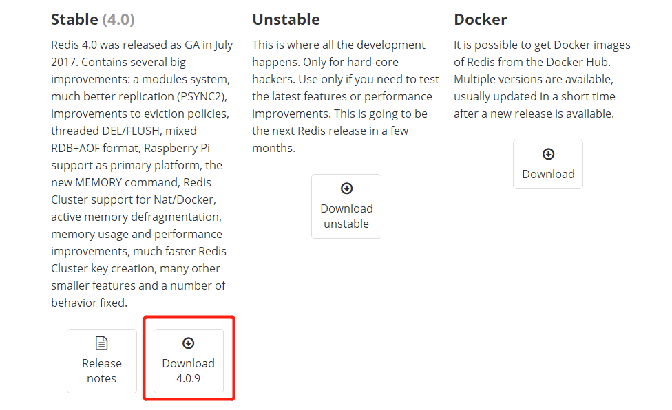
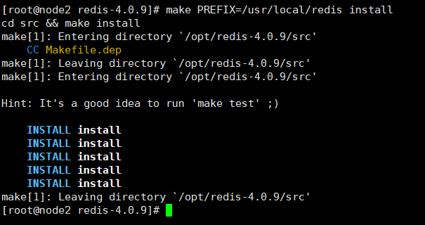
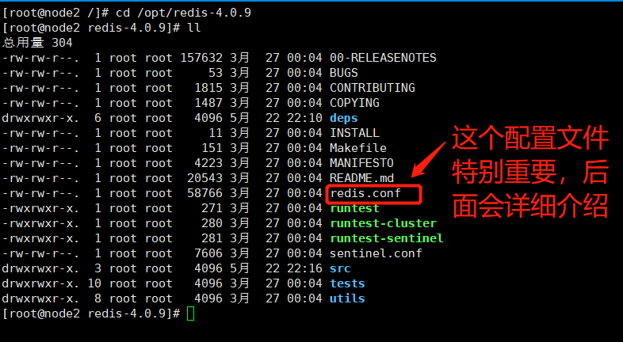
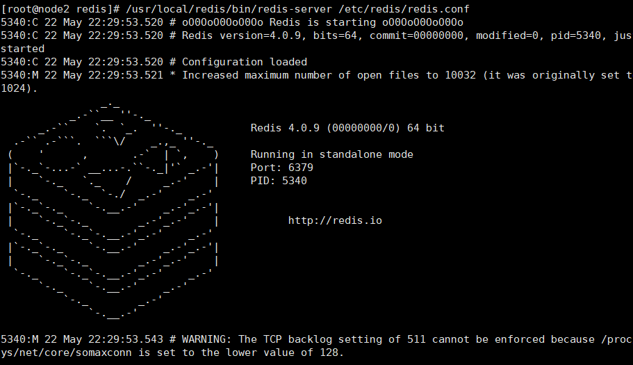

　　工作中一直在用 Redis，但是一直没有进行系统的总结，这个系列的博客将整体的介绍 Redis 的用法。

### 1、Redis 的简介

　　Redis:REmote DIctionary Server(远程字典服务)。

　　是由意大利人Salvatore Sanfilippo（网名：antirez）开发的一款内存高速**缓存**数据库。是完全开源免费的，用**C语言**编写的，遵守BSD协议，高性能的(**key/value**)**分布式内存数据库**，基于内存运行并支持**持久化**的**NoSQL**数据库。

　　具体详细的概念可以参考[百度百科](https://baike.baidu.com/item/Redis/6549233)。

　　PS:关于 Redis 的具体概念以及具体应用场景，其实现在说都有些空洞，后面我们在介绍 Redis 的相关特性的时候会进行详细介绍。下面我们来直接进行安装（由于主流的都是在Linux服务器上使用Redis，很少有在Windows系统上使用的，所以下面我是以Linux版本的Redis为例进行安装）。

### 2、Redis 下载

　　Redis 的官网是：[https://redis.io](https://redis.io/)   这是全英文的，英语不太好的，我们也可以查看中文网站：<http://www.redis.cn/> 。

　　在官网中点击 [Check the downloads page](https://redis.io/download) 

　　

　　进入下载页面，下载最新稳定版的 Redis:

　　

### 3、安装环境

　　我们采用虚拟机来模拟Linux服务器。虚拟机的安装教程可以参考我的[这篇博客](http://www.cnblogs.com/ysocean/p/7689146.html)。

　　虚拟机安装完成之后，我们启动Linux系统，将第二步下载的 redis-4.0.9.tar.gz 文件通过工具复制到 /opt 目录下，然后在通过如下命令进行解压：

```
1 tar -zxf redis-4.0.9.tar.gz
```

　　解压之后如下图所示：

　　

　　由于在安装过程中需要对源码进行编译，而编译依赖 gcc 环境。如下图所示，则是没有进行 gcc 的安装：

　　

　　下面，我们通过如下命令进行 gcc 的安装（yum 方式需要联网）：

```
1 yum install gcc-c++
```

　　安装完成之后，在输入 gcc -v 命令，则不会出现上面的提示信息了。

### 4、编译安装

　　进入到第二步解压的Redis文件目录，然后输入 make 命令进行编译：

```
1 cd /opt/redis-4.0.9
2 make
```

　　

　　编译完成之后，还是在该目录下输入 make install 进行构建：

　　该命令会生成 Redis的5个二进制文件，默认是在 /usr/local/bin 路径下，但是我们可以手动指定生成的文件位置，将 make install 变成：

```
1 make PREFIX=/usr/local/redis install 
```

　　

　　完成之后，就会在 /usr/local/redis/bin 目录下生成如下几个二进制文件：

　　

　　①、redis-server：Redis服务器

　　②、redis-cli：Redis命令行客户端

　　③、redis-benchmark：Redis性能测试工具

　　④、redis-check-aof：AOF文件修复工具

　　⑤、redis-check-rdb：RDB文件检查工具

### 5、启动Redis

　　首先，我们进入 Redis 文件的安装目录：

　　

　　可以看到该目下有 redis.conf 配置文件，这个文件特别重要，后期的很多配置都是在这里面进行，为了防止该文件被破坏，我们可以将该文件复制到 /etc/redis 目录下：

　　

　　然后通过如下命令即可启动：

```
1 /usr/local/redis/bin/redis-server /etc/redis/redis.conf
```

　　启动后出现如下界面：

　　

　　注意：此种方式启动 Redis，当我们关闭命令窗口时，则 redis-server 程序也结束了，这显然是不友好的，我们需要将Redis设置为以守护进程的方式进行启动。

　　在 redis.conf 文件中，找到daemonize，将其设置为yes即可：

　　

　　还是以上面的命令启动 redis-server 服务。

　　启动之后可以通过如下命令查看 Redis 服务是否启动：

```
1 ps -ef | grep redis
```

　　启动完成之后，我们执行第 4 步编译安装的 redis-cli 文件，输入如下命令进入 Redis 客户端：

```
1 /usr/local/redis/bin/redis-cli
```

　　

### 6、关闭Redis

　　①、redis-cli shutdown：安全关闭，但是只适用于没有配置密码的场景（一般情况下不会给Redis设置密码）。

　　②、kill -9 pid：强制关闭，可能会造成Redis内存数据丢失。

### 7、注意事项

　　①、我们在第 4 步编译安装生成了五个二进制文件，每次要执行该文件都要输入全路径，很不方便，为了能在任何路径下执行该二进制文件，我们可以对其进行环境变量的配置。

　　输入 vim /etc/profile 命令，将如下内容添加到文件末尾：

　　

　　接着输入**:wq**保存并退出，然后输入 source /etc/profile 使得配置文件生效即可。

　　接着我们便可在任意路径下启动Redis服务了：（下面是根目录下启动）

　　

 

　　②、可能没有安装 gcc，直接在Redis解压目录下执行make 命令，会发现缺少编译器gcc，这时候通过 yum install gcc-c++ 命令安装gcc，然后接着执行 make 命令，但是发现还是报错：

　　jemalloc/jemalloc.h：没有那个文件或目录

　　原因：这次报错是因为第一次执行 make 命令有一些残存的文件没有清除干净，这时候需要执行 make distclean 命令后，再执行 make 命令即可。